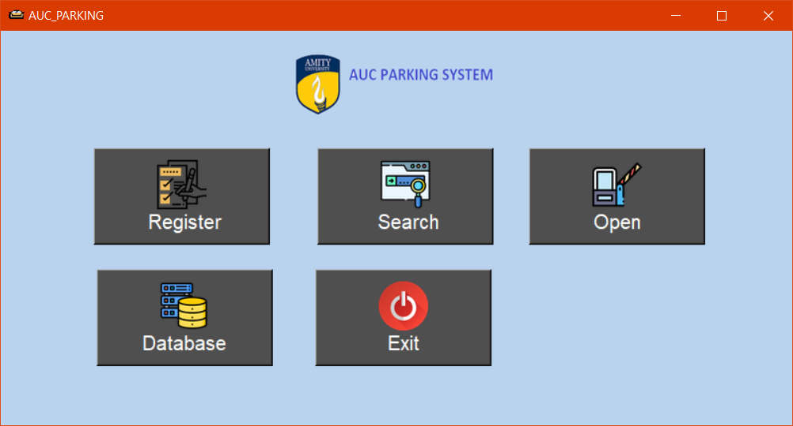

# College_Parking_System
An Application to Manage and maintain records in a paperless way and use the data to open the gate and perform other tasks.

This Application helps manage the parking place in a Paperless way. 
Simply enter the Name Of the owner and click or upload the picture of numberplate and Register.
When Searching click or upload the picture of numberplate. 
The popup will show the deating of Checkin time, Checkout time, Owner Name, Purpose, Total Duration.
The numberplate is detected using contour detection and EasyOCR.

## Prerequisites
1. Python >=3.6
2. OpenCV

## Run
`pip install requirements.txt`

## Preview

## Please open an issue if
* Aryan Singh
* xoplaysvideogames@gmail.com

